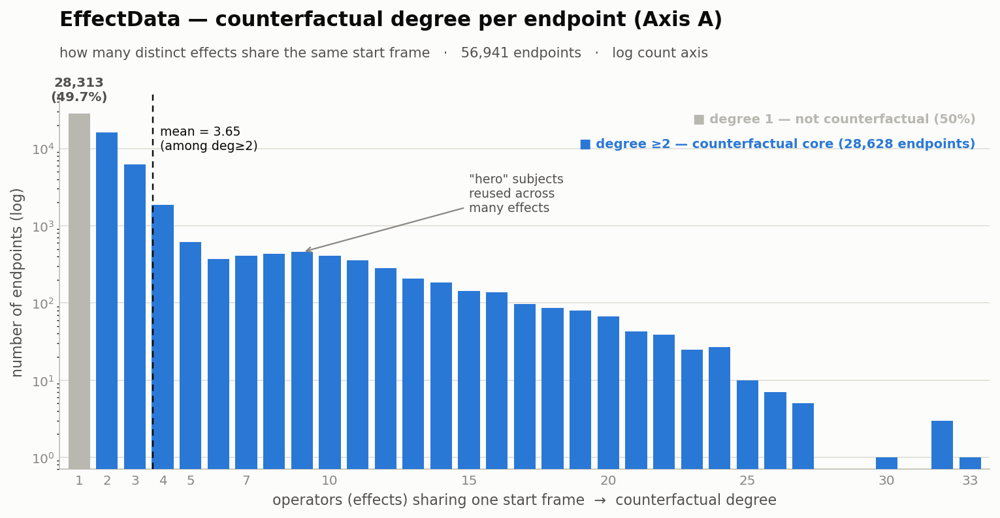

# EffectData — counterfactual structure

Measured 2026-08-26 from `annotations.json` (all 132,850 filenames, metadata only).
Reproduce: `python scripts/effectdata/frontier_both_axis.py` and `.../plot_axisA.py`.

## The two axes

EffectData has **two node types** — **operators** (effects) and **endpoints** — and two
counterfactual axes over them:

- **Axis A — counterfactual:** *same endpoint, different operator.*
- **Axis B — demonstration:** *same operator, different endpoint.*

**EffectData is one-sided.** In a full transition an endpoint is the *pair* (start, end),
but here the effect *determines* the end — change the effect and the end changes too. So
there is no fixed start+end pair to hold constant; the endpoint reduces to the **shared
start frame** (the subject id). On the resulting (effect × subject) graph both axes are
alive:

| axis | fixed | varies | formula |
|---|---|---|---|
| **A — counterfactual** | start frame (subject) | effect | `Σ_subject C(deg, 2)` |
| **B — demonstration** | effect | start frame (subject) | `Σ_effect C(deg, 2)` |
| **R — both at once** | — | — | rectangles: 2 effects × 2 subjects, all 4 clips present |

A **pair** counts *contrastable two-clip combinations*, not clips. A subject seen under
`d` effects yields `C(d,2)` Axis-A pairs (e.g. one subject under 33 effects → 528 pairs
from 33 clips). A **rectangle** is the atomic both-axis cell: within it, fixing the effect
gives a demonstration pair and fixing the subject gives a counterfactual pair.

## Full-dataset numbers

| quantity | value |
|---|---|
| operators (effects) | **3,061** |
| endpoints (subjects) | **56,941** |
| subjects reused under ≥2 effects | 28,628 (**50.3%**) |
| **Axis A — counterfactual pairs** | **308,746** |
| **Axis B — demonstration pairs** | **2,952,671** (≈ 9.6× A) |
| **R — both-axis rectangles** | **10,418** |

EffectData is engineered for **demonstration breadth**; counterfactual reuse is a sparse,
hub-concentrated byproduct. Its distinctive value is **operator breadth** (3,061 effects),
not counterfactual density.

## Axis A — counterfactual degree per endpoint

The descriptive statistic (linear, hub-robust): for each endpoint, count its operators.

| stat | all endpoints | counterfactual only (deg ≥2) |
|---|---|---|
| mean | 2.33 | **3.65** |
| variance | 7.73 | 11.9 |
| median | 2 | — |
| p90 / p95 / p99 | 4 / 8 / 16 | — |
| max | 33 | 33 |
| share | 100% | 50.3% (28,628) |



**Bimodal:** ~half of endpoints (28,313) are **singletons** — one effect on that start
frame, zero counterfactual value (gray bar). Among the counterfactual core (blue) the
degree falls off from 2, then shows a distinct **"hero" hump at degrees 7–10** — start
frames deliberately reused across many effects — tailing to 33.

## Axis B — demonstration degree per operator

Nearly **uniform** by construction (the authors sampled ~45 subjects per effect):

`mean 43.4 · std 9.4 · median 45 · min 2 · max 135 · p90 = p95 = p99 = 45`

## Size ↔ counterfactuality frontier (`frontier_results.json`)

How much of each axis survives if you keep a subset. Endpoint = subject; size = clips ≈ GB.

| operating point | GB | Axis A | R (both-axis) | operators |
|---|---|---|---|---|
| **full** | 822 | 100% | 100% | 3,061 |
| **drop 1-effect subjects** (k≥2 core) | **647** | **100%** | **100%** | 2,917 |
| k≥3 core | 447 | 94.8% | 88.8% | 2,917 |
| k≥4 core | 333 | 88.8% | 76.4% | 2,917 |
| top-5,000 counterfactual subjects | 300 | 86.2% | — | 3,061 |
| top-2,000 counterfactual subjects | **177** | **66.5%** | — | 3,061 |
| k≥8 core | 236 | 78.4% | 58.6% | 2,912 |

Three facts: (1) **the bottom ~175 GB is free** — the 28,313 singleton subjects add zero
counterfactuality; (2) **operator breadth survives every shrink** (effects stay
~2,917/3,061, since every effect has ≥2, usually ≥22, subjects); (3) the knee is
**top-2,000 subjects ≈ 177 GB → ⅔ of Axis A** (all operators), or **k≥3 ≈ 447 GB → 89% of R**.

## Building a counterfactual set

A counterfactual set = **one subject seen under many effects** (fix the start, vary the operator):

```python
import json, zipfile
from pathlib import Path
from collections import defaultdict
DATA = Path("data/raw/effectdata"); TAGS = {"F", "M", "Z"}
ann = json.load(open(DATA / "annotations.json"))

def subject_of(fn, video_path):
    eff = video_path.split("/")[0]
    rest = fn[:-4][len(eff)+1:]
    p = rest.rsplit(",", 1)
    return eff, (p[0] if (len(p) == 2 and p[1] in TAGS) else rest)

subj2clips = defaultdict(list)              # subject -> [(effect, video_path)]
for fn, rec in ann.items():
    eff, sid = subject_of(fn, rec["video_path"])
    subj2clips[sid].append((eff, rec["video_path"]))

sid = max(subj2clips, key=lambda s: len(subj2clips[s]))     # the top "hero" subject
print(sid, len(subj2clips[sid]), "effects on the same start frame")

out = Path("/tmp/cf_set"); out.mkdir(exist_ok=True)         # extract its clips from local zips
for eff, vpath in subj2clips[sid]:
    with zipfile.ZipFile(DATA / "Videos" / f"{eff}.zip") as zf:
        zf.extract(vpath, out)                              # member name == video_path
```

To bias toward strong counterfactual sets, keep subjects with high degree (the hero hump):
`[s for s, c in subj2clips.items() if len(c) >= 7]`.

## Caveats

- The subject/endpoint key is **our derivation** (undocumented by the authors — checked HF
  card, paper, project page). Validated: same middle token → same start frame.
- Same-source start frames are **codec-noise-close (~0.7/255 mean, ≤11/255), not byte-exact**
  — independent H.264 encodes of one source. Gate same-source with a first-frame mean-diff
  threshold (>2/255 cleanly separates same-source from different-subject) if you need it exact.
